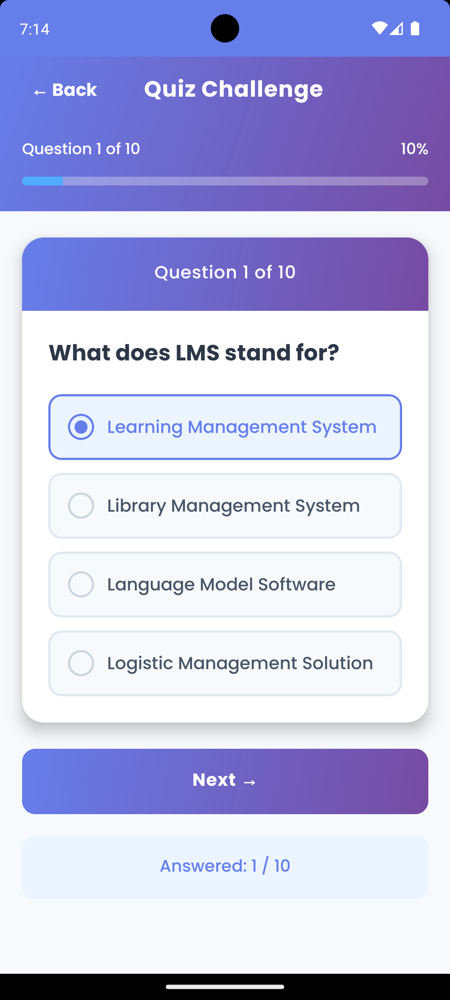
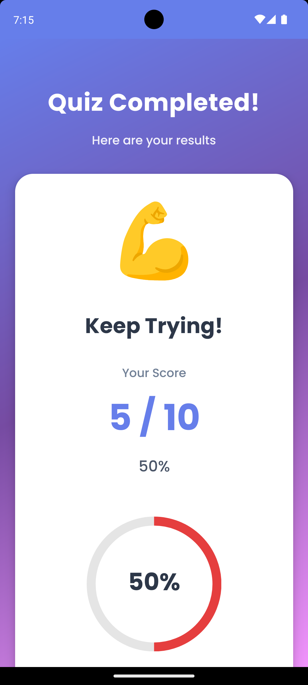
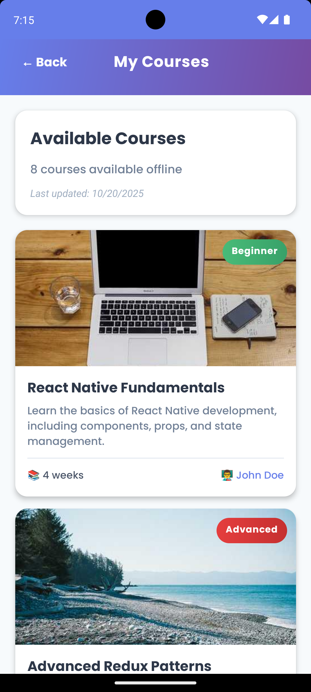

# 📚 EduQuiz - Your Gateway to Knowledge & Growth

A beautiful, feature-rich React Native LMS application with quiz functionality and offline course support.


## ✨ Features

### 🎯 Quiz Module
- **Interactive MCQ Questions**: Multiple-choice questions with single correct answers
- **Real-time Progress Tracking**: Visual progress bar showing "Question X of Y"
- **Score Calculation**: Automatic scoring and detailed results
- **Beautiful Animations**: Smooth transitions between questions
- **Answer Review**: Detailed breakdown of correct and incorrect answers

### 📚 Course List Module
- **Offline Support**: Courses cached using MMKV for ultra-fast offline access
- **Pull-to-Refresh**: Update course list with smooth refresh animation
- **Rich Course Cards**: Display course details including title, description, duration, level, and instructor
- **Persistent Storage**: Previously loaded courses remain available offline
- **Level Badges**: Color-coded difficulty levels (Beginner, Intermediate, Advanced)

### 🎨 UI/UX Highlights
- **Modern Gradient Design**: Beautiful gradient backgrounds throughout
- **Smooth Animations**: React Native Reanimated for 60fps animations
- **Progress Indicators**: Visual feedback for quiz progress and scores
- **Responsive Layout**: Optimized for various screen sizes
- **Intuitive Navigation**: Easy-to-use navigation with clear CTAs

## 🛠️ Tech Stack

- **Framework**: React Native CLI
- **Language**: TypeScript
- **State Management**: Redux Toolkit
- **Persistence**: Redux Persist + MMKV
- **Navigation**: React Navigation v6
- **Animations**: React Native Reanimated
- **UI Components**: React Native Modal, Progress Indicators
- **Styling**: Linear Gradient, Custom Components

## 📋 Prerequisites

Before you begin, ensure you have the following installed:

- **Node.js** (v16 or higher)
- **npm** or **yarn**
- **React Native CLI**
- **Android Studio** (for Android development)
- **Xcode** (for iOS development, macOS only)
- **JDK 11** or higher

## 🚀 Installation

### 1. Clone the Repository
```bash
git clone https://github.com/Nazim-hasan/EduQuiz
cd learnhub-lms
```

### 2. Install Dependencies
```bash
yarn
```

### 3. Install iOS Pods (iOS only)
```bash
cd ios && pod install && cd ..
```

### 4. Configure TypeScript
The project comes with `tsconfig.json` pre-configured. No additional setup needed.

## 📦 Project Structure
```
LearnHub/
├── src/
│   ├── components/          # Reusable UI components
│   │   ├── AnimatedButton.tsx
│   │   ├── CourseCard.tsx
│   │   └── QuizCard.tsx
│   ├── data/               # Mock data (JSON files)
│   │   ├── questions.json
│   │   └── courses.json
│   ├── navigation/         # Navigation types
│   │   └── types.ts
│   ├── redux/              # Redux store and slices
│   │   ├── store.ts
│   │   ├── hooks.ts
│   │   └── slices/
│   │       ├── quizSlice.ts
│   │       └── courseSlice.ts
│   ├── screens/            # App screens
│   │   ├── HomeScreen.tsx
│   │   ├── QuizScreen.tsx
│   │   ├── QuizResultScreen.tsx
│   │   └── CourseListScreen.tsx
│   ├── types/              # TypeScript type definitions
│   │   └── index.ts
│   └── utils/              # Utility functions
│       └── storage.ts
├── App.tsx                 # Main app component
├── tsconfig.json          # TypeScript configuration
├── babel.config.js        # Babel configuration
└── package.json
```

## 🏃‍♂️ Running the Application

### Start Metro Bundler
```bash
yarn start --reset-cache
```

### Run on Android
```bash
yarn android
```

### Run on iOS
```bash
yarn ios
```

## 📱 App Screens

### 1. Home Screen
- Welcome message with user greeting
- Two main action buttons: "Start Quiz" and "Browse Courses"
- Statistics display showing available questions and courses
- Beautiful gradient background with floating animations

### 2. Quiz Screen
- Question display with 4 multiple-choice options
- Progress bar showing current question number
- Previous/Next navigation buttons
- Answer counter tracking completed questions
- Submit button on the last question

### 3. Quiz Result Screen
- Overall score display with percentage
- Animated score reveal with celebration emojis
- Circular progress indicator
- Detailed question-by-question breakdown
- Correct/Incorrect answer highlighting
- Options to retake quiz or return home

### 4. Course List Screen
- Scrollable list of available courses
- Each course card shows:
  - Course thumbnail
  - Title and description
  - Duration and instructor
  - Difficulty level badge
- Pull-to-refresh functionality
- Offline indicator showing cached courses
- Last updated timestamp

## 🗄️ State Management

### Redux Slices

#### Quiz Slice
```typescript
- questions: Array of quiz questions
- currentQuestionIndex: Current question being displayed
- selectedAnswers: User's answer selections
- score: Final quiz score
- isQuizCompleted: Quiz completion status
```

#### Course Slice
```typescript
- courses: Array of course objects
- loading: Loading state for API calls
- error: Error messages
- lastFetched: Timestamp of last successful fetch
```

### MMKV Storage

Used for:
- Redux persist storage (faster than AsyncStorage)
- Course list caching
- User preferences (future enhancement)

## 🔌 Offline Support

The app implements offline functionality through:

1. **MMKV Caching**: Ultra-fast synchronous storage
2. **Redux Persist**: Automatic state persistence
3. **Cache Timestamp**: Track when data was last updated
4. **Graceful Degradation**: Show cached data when offline
5. **Visual Feedback**: Offline indicators in UI

### How It Works:
1. On first load, courses are fetched from mock API
2. Courses are automatically cached in MMKV
3. On subsequent loads, cached courses are shown immediately
4. Pull-to-refresh updates the cache
5. If offline, cached courses remain accessible

## 🎨 Customization

### Adding More Questions
Edit `src/data/questions.json`:
```json
{
  "id": 11,
  "question": "Your question here?",
  "options": ["Option 1", "Option 2", "Option 3", "Option 4"],
  "answer": "Option 1"
}
```

### Adding More Courses
Edit `src/data/courses.json`:
```json
{
  "id": 9,
  "title": "Your Course Title",
  "description": "Course description here",
  "duration": "6 weeks",
  "level": "Intermediate",
  "instructor": "Instructor Name",
  "thumbnail": "https://placeholder-url.com"
}
```

## 📦 Dependencies

### Core Dependencies
```json
{
  "@react-navigation/native": "^6.x",
  "@react-navigation/native-stack": "^6.x",
  "@reduxjs/toolkit": "^2.x",
  "react-redux": "^9.x",
  "redux-persist": "^6.x",
  "react-native-mmkv": "^2.x",
  "react-native-reanimated": "^3.x",
  "react-native-linear-gradient": "^2.x",
  "lottie-react-native": "^6.x",
  "react-native-modal": "^13.x",
  "react-native-progress": "^5.x"
}
```

### Dev Dependencies
```json
{
  "typescript": "^5.x",
  "@types/react": "^18.x",
  "@types/react-native": "^0.72.x",
  "@tsconfig/react-native": "^3.x"
}
```

## 🚧 Troubleshooting

### Metro Bundler Issues
```bash
# Clear cache and restart
yarn start -- --reset-cache
```

### Android Build Issues
```bash
cd android && ./gradlew clean && cd ..
yarn android
```

### iOS Build Issues
```bash
cd ios && pod deintegrate && pod install && cd ..
yarn ios
```

### TypeScript Errors
```bash
# Restart TypeScript server in your IDE
# or
npx tsc --noEmit
```

## 📄 License

This project is licensed under the MIT License - see the [LICENSE](LICENSE) file for details.

## 👨‍💻 Author

**Nazim Hasan**
- GitHub: [@nazim-hasan](https://github.com/Nazim-hasan)
- Email: connect.nazimhasan@gmail.com
- LinkedIn: [Nazim Hasan](https://www.linkedin.com/in/dev-nazim-hasan/)

## 🙏 Acknowledgments

- React Native Community
- Redux Toolkit Team
- All open-source contributors

## 📸 Screenshots

### Home Screen


### Quiz Screen


### Quiz Results


### Course List



**Made with ❤️ and React Native**